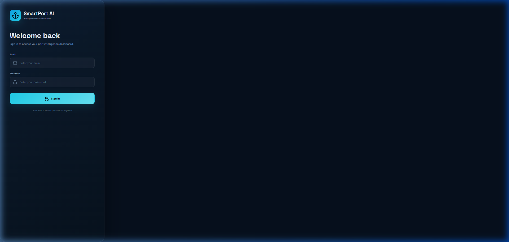
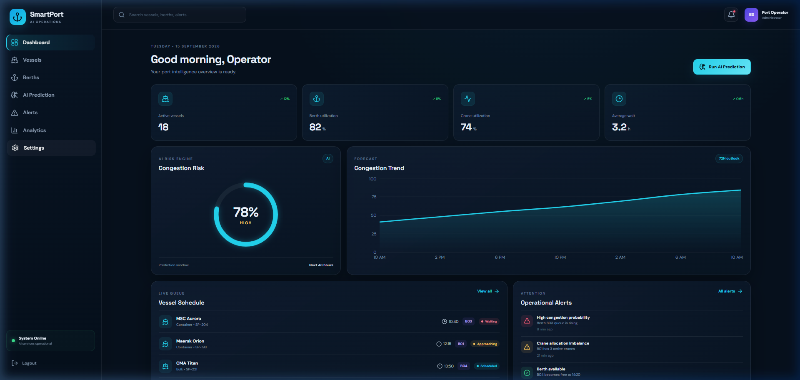
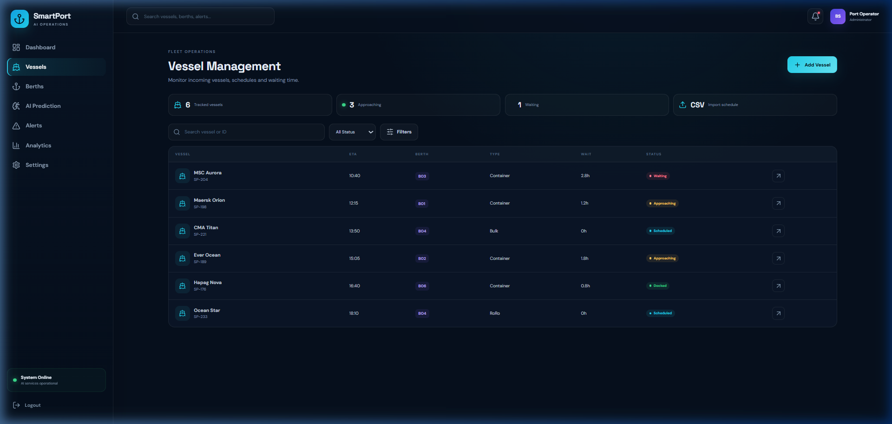
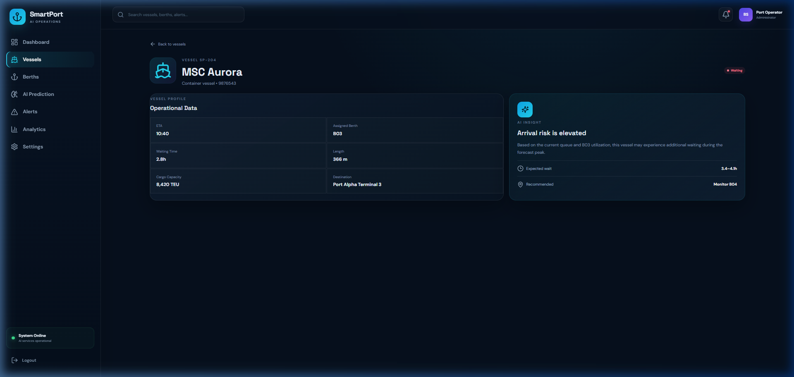
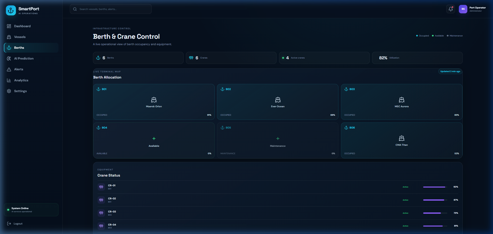
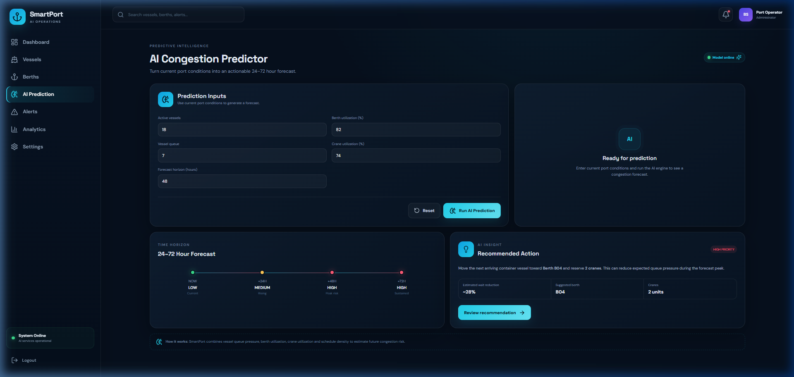
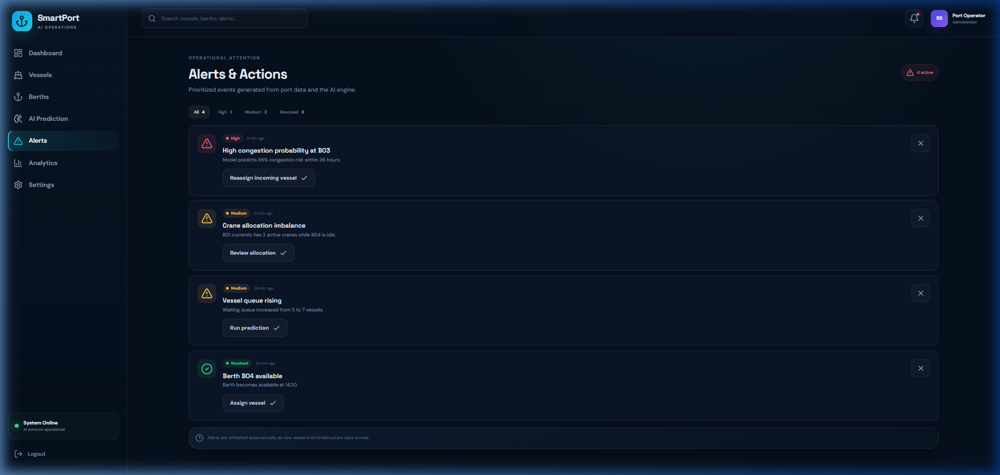
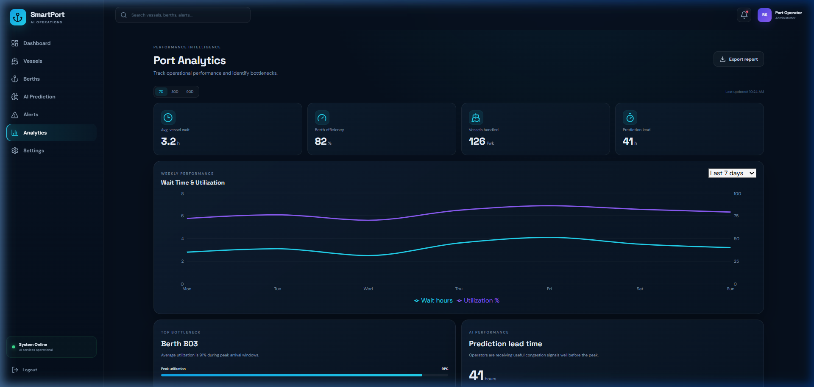
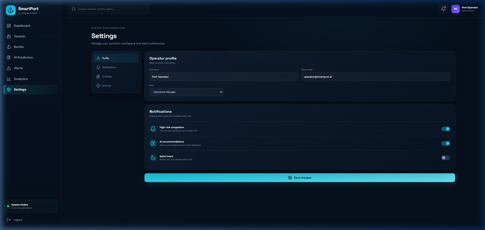

# 📸 SmartPort AI — System Demo & UI Gallery

This folder contains high-resolution UI walkthroughs, screenshots, and animations demonstrating all core features of the **SmartPort AI** maritime management platform.

---

## 🎬 Live Platform Walkthrough

---

## 🖼️ Feature Screen Gallery

### 1. Terminal Operator Authentication
Clean, secure authentication screen for port operators and dispatchers.

---

### 2. Real-Time Operations Cockpit & Congestion Gauge
Live congestion gauge, port throughput KPIs, berth utilization breakdown, active vessel queues, and 7-day traffic trends.

---

### 3. Vessel Fleet Queue & Tracking
Live fleet overview with real-time status filtering (Moored, Approaching, Waiting, Departing), TEU metrics, and priority scheduling.

---

### 4. Deep Vessel Telemetry & Cargo Breakdown
Detailed vessel modal with cargo type, dimensions, draft depth, destination, and berth assignment controls.

---

### 5. Digital Quay Matrix & STS Crane Telemetry
Berth occupancy visualization (B01–B06) paired with live Ship-to-Shore (STS) crane operational status and moves/hour rates.

---

### 6. AI Predictive Simulator & Mitigation Recommendations
Multi-factor congestion simulation (vessel pressure, weather impact, queue depth) paired with automated tactical mitigation advisories (slow-steaming, berth re-routes).

---

### 7. Centralized Operational Alert Center
Prioritized real-time alerts (High / Medium / Low) with one-click resolution workflows.

---

### 8. Historical Performance Analytics & KPI Reports
7-day, 30-day, and 90-day throughput trend charts, turnaround metrics, and instant CSV export.

---

### 9. Operator Settings & Notification Thresholds
Customizable alert sensitivities, quiet hours, and port manager profile controls.

