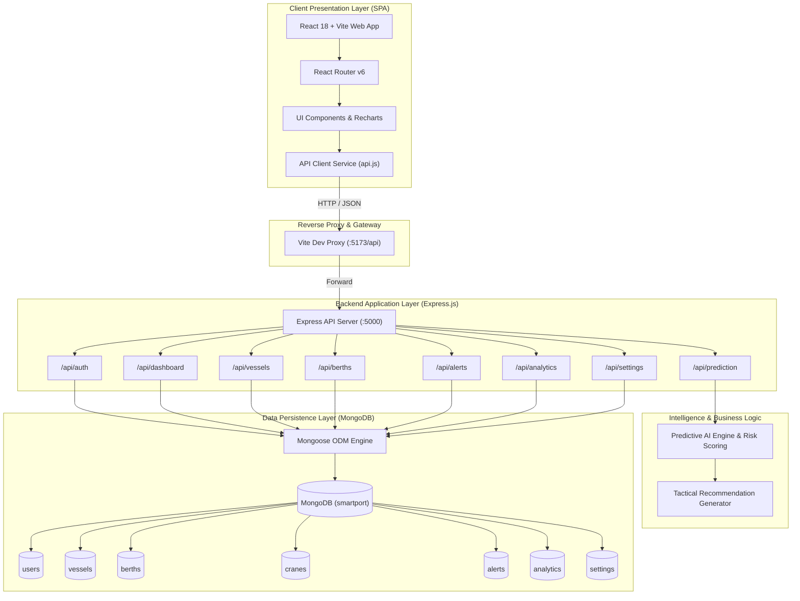
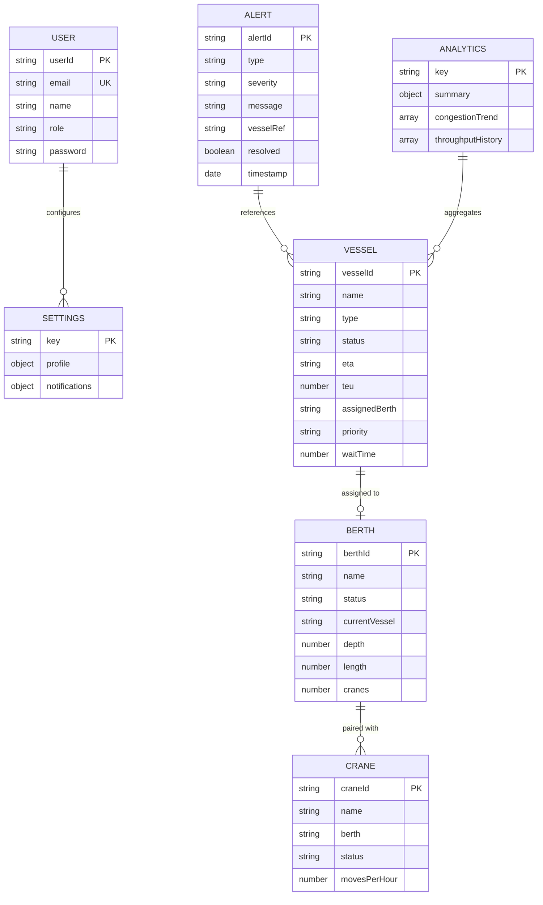
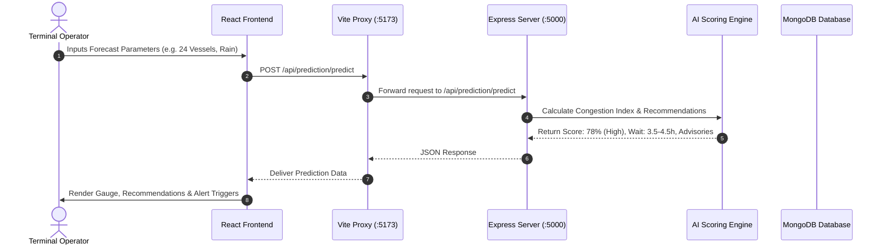

# 🏛️ System Architecture: SmartPort AI Platform

## 1. High-Level System Architecture

SmartPort AI is built on a modern, decoupled **Full-Stack MERN-style Architecture** (React 18, Node.js, Express.js, and MongoDB) engineered for high responsiveness, real-time telemetry processing, and clean separation of concerns.

---

## 2. Layer-by-Layer Breakdown

### A. Presentation Layer (Frontend)
- **Framework**: React 18 with Vite for ultra-fast Hot Module Replacement (HMR) and optimized build bundles.
- **Design System**: Custom CSS variables, responsive grid layouts, glassmorphism card styling, and dark maritime color palette.
- **Data Visualization**: `recharts` for dynamic line graphs, area charts, bar graphs, and custom SVG congestion gauges.
- **State & Navigation**: React Router v6 for client-side routing across 8 dedicated operational views with protected authentication guards.

### B. Controller & API Layer (Backend)
- **Runtime**: Node.js v18+ with Express.js RESTful API architecture.
- **Middleware**:
  - `cors`: Cross-Origin Resource Sharing enablement for local and external development environments.
  - `morgan`: Live HTTP request logging in development format (`:method :url :status :response-time ms`).
  - `express.json()`: High-performance JSON request body parsing.
  - Custom Global Error Handler for centralized error management and descriptive responses.

### C. Intelligence & Predictive Engine
- **Congestion Scoring Formula**:
  $$\text{Raw Pressure} = (1.8 \cdot V + 0.45 \cdot B + 3.2 \cdot Q - 0.3 \cdot (C - 50)) \times W_{\text{mult}}$$
  Where:
  - $V$: Number of active vessels in port / inbound
  - $B$: Berth utilization percentage ($0-100\%$)
  - $Q$: Number of vessels waiting in queue
  - $C$: Available crane percentage ($0-100\%$)
  - $W_{\text{mult}}$: Weather severity multiplier ($1.0$ for Clear, $1.15$ for Rain/Fog, $1.35$ for Storm)
- **Recommendation Engine**: Evaluates the computed score against operational safety thresholds and generates contextual mitigations (speed reductions, berth swaps, and crane reassignments).

---

## 3. Database Schema Design (Entity Relationship)

---

## 4. API Request & Data Flow Lifecycle

---

## 5. Security & Production Readiness

- **Sanitized Inputs**: Strict request validation across all CRUD endpoints.
- **Environment Isolation**: Configurable ports and MongoDB URIs managed via `.env` files.
- **Auto-Seeding Engine**: Smart database initialization prevents data collision on server restart while providing instant out-of-the-box demo capabilities.
